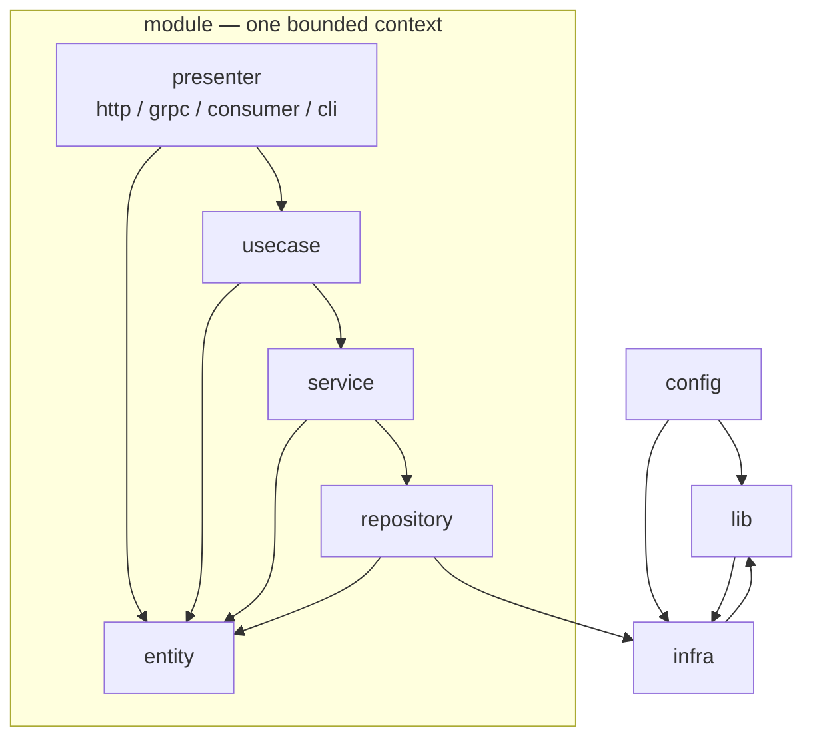
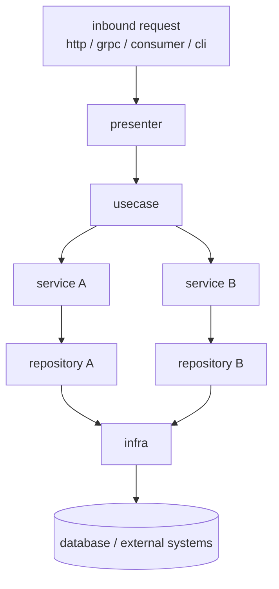
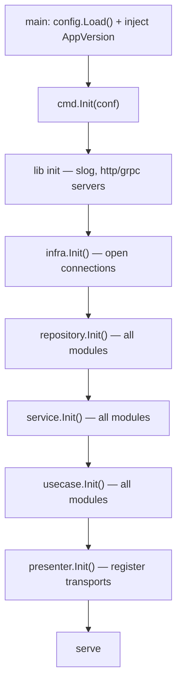

# Final Structure

```
main.go
/cmd
/config
/infra
/module
/migrations
/lib
```

> **Naming note:** the foundation utility package is named `lib` throughout (your diagram and tree use `lib`; some earlier prose called it `pkg` — treat `lib` as canonical). There is **no top-level `/service`**: services are an internal layer of each module under `/module`. See the *Decisions & deviations* section at the end for the reasoning.
> 

> **Shared library note:** the company toolkit `github.com/moeghifar/libgo` is an **external dependency**, imported as `github.com/moeghifar/libgo/pkg/<tool>` (e.g. `.../pkg/envy`, `.../pkg/climd`). Do not confuse libgo's internal `pkg/` layout with this app's internal `lib` package — `lib` is where the app initializes and, where useful, thinly wraps libgo so call-sites stay stable if a tool's signature changes.
> 

```
require github.com/moeghifar/libgo latest
```

---

### 1 - main.go — as the entry point

1. reading public variable that injected from build named as `appVersion`
2. load configuration files from package `config`
3. inject the `appVersion` from variable into built up `config`
4. then call the cmd for main execution from `cmd/cmd.go`

```go
// file main.go
package main

import (
    "myapp/cmd"
    "myapp/config"
)

// AppVersion is injected at build time:
//   go build -ldflags "-X main.AppVersion=$(git describe --tags --always)" -o app .
var AppVersion string = "local"

func main() {
    conf := config.Load()        // config uses libgo/envy under the hood
    conf.AppVersion = AppVersion // runtime value, not an env var
    cmd.Init(conf)
}
```

`AppVersion` is deliberately **not** an env field — it comes from the linker, not the environment. In the `config` struct it carries no `env` tag, so `envy` skips it (see section 5).

---

### 2 - cmd — package that holds the command instruction

1. the core application runs in the `cmd` package
2. every package entrypoint file name should match the package name (e.g. package `cmd` → entrypoint `cmd.go`)
3. it holds the caller for every command-line or executable func
4. example below holds migrations using `uptrace/bun`

directory structure:

```
cmd/
 - cmd.go        // builds the climd app and Execute()s it
 - serve.go      // the `serve` command — boots the service
 - migration.go  // the `db` command + subcommands (uptrace/bun)
 - cli.go        // any additional one-off commands
```

The command layer is built with `libgo/climd`. `cmd.Init` assembles a `climd.AppConfig` from the per-command builders and hands control to `climd.Execute`, which dispatches on `os.Args` and exits non-zero on error.

```go
// file cmd/cmd.go
package cmd

import (
    "github.com/moeghifar/libgo/pkg/climd"
    "myapp/config"
)

func Init(conf config.Config) {
    app := climd.AppConfig{
        Name:        conf.App.Name,
        Version:     conf.AppVersion, // surfaced by `myapp --version`
        Description: "myapp service entrypoint",
        Commands: []climd.Command{
            serveCommand(conf),
            migrationCommand(conf),
        },
    }
    climd.Execute(app) // parses os.Args, prints errors to stderr, os.Exit(1) on failure
}
```

The `serve` command is where the **bottom-up build order** actually runs. climd flags select which presenters to start; flags are presence-based booleans (a flag with no value means "enabled").

```go
// file cmd/serve.go
package cmd

import (
    "context"

    "github.com/moeghifar/libgo/pkg/climd"
    "myapp/config"
    "myapp/infra"
    "myapp/lib"
    "myapp/module/account/presenter"
    "myapp/module/account/repository"
    "myapp/module/account/service"
    "myapp/module/account/usecase"
)

func serveCommand(conf config.Config) climd.Command {
    return climd.Command{
        Name:  "serve",
        Short: "Start the service",
        Long:  "Boots infra and modules, then serves the selected presenters.",
        Flags: []climd.Flag{
            {Name: "http", Usage: "enable the HTTP presenter"},
            {Name: "grpc", Usage: "enable the gRPC presenter"},
            {Name: "consumer", Usage: "enable the message-consumer presenter"},
        },
        Run: func(ctx context.Context, args []string, flags map[string]string) error {
            // ---- build order: foundation -> infra -> repo -> service -> usecase -> presenter
            lib.Init(lib.LogOptions{Level: conf.Log.Level, Format: conf.Log.Format})

            deps, err := infra.Init(ctx, conf)
            if err != nil {
                return err
            }

            repos := repository.Init(deps)
            svcs := service.Init(repos)
            ucs := usecase.Init(svcs)

            // presence of a flag == enabled
            _, http := flags["http"]
            _, grpc := flags["grpc"]
            _, consumer := flags["consumer"]

            return presenter.Init(ctx, conf, ucs, presenter.Enable{
                HTTP:     http,
                GRPC:     grpc,
                Consumer: consumer,
            })
        },
    }
}
```

Migrations use climd **subcommands** (`db up`, `db create`) over `uptrace/bun`:

```go
// file cmd/migration.go
package cmd

import (
    "context"

    "github.com/moeghifar/libgo/pkg/climd"
    "myapp/config"
    "myapp/infra"
    "myapp/migrations"
)

func migrationCommand(conf config.Config) climd.Command {
    return climd.Command{
        Name:  "db",
        Short: "Database migration operations",
        SubCommands: []climd.SubCommand{
            {
                Name:  "up",
                Short: "Apply all pending migrations",
                Run: func(ctx context.Context, args []string, flags map[string]string) error {
                    deps, err := infra.Init(ctx, conf)
                    if err != nil {
                        return err
                    }
                    return migrations.Up(ctx, deps.DB)
                },
            },
            {
                Name:  "create",
                Short: "Scaffold a new migration file",
                Flags: []climd.Flag{
                    {Name: "name", Short: "n", Usage: "migration name", Required: true},
                },
                Run: func(ctx context.Context, args []string, flags map[string]string) error {
                    return migrations.Create(ctx, flags["name"])
                },
            },
        },
    }
}
```

**Invocation** (climd flags are space-delimited, not `--flag=value`):

```bash
myapp serve --http --grpc                 # start HTTP + gRPC presenters
myapp db up                               # apply migrations
myapp db create --name add_users_table    # scaffold a migration
myapp --version                           # prints conf.AppVersion
```

The ordering inside `serve` is the single most important rule in this package: **data flows top-down at runtime, but objects are constructed bottom-up.** A presenter cannot exist until its usecase exists; a usecase cannot exist until its services exist; and so on down to infra. Construction is the mirror image of the request path.

---

### 3 - infra

Use package `infra` as the layer which handles a connection to external parties, such as: database, HTTP client, gRPC client, client SDK, KMS, cloud provider, Pub/Sub, etc.

This package abstracts:

1. Connection initialization
2. Adapted client handling
3. Re-connection process where not provided by the client
4. **Not** allowed to import from other modules, except `lib`
5. Only allowed to be imported by package `repository`

Rule 5 is the load-bearing constraint: **`repository` is the only layer permitted to import `infra`.** No service, usecase, or presenter ever touches a raw DB handle or external client directly. This keeps infrastructure swappable and the domain testable with mocks.

---

### 4 - module

A `module` is one **bounded context** (DDD) implemented as a self-contained vertical slice. This is the "modular" half of *modular monolith*: each module owns its own layers and domain types and could, in principle, be extracted into a separate service later — but only if the module boundary is respected.

### 4.1 - Layers

A module has four ordered layers plus one independent innermost layer:

| Layer | Role | May import |
| --- | --- | --- |
| `entity` | Pure domain data objects. The innermost ring. | nothing (only `lib` / stdlib) |
| `repository` | Persistence / external access for one model or table. | `entity`, `infra`, `lib` |
| `service` | Domain logic for one aggregate. | `entity`, its own `repository`, `lib` |
| `usecase` | Application logic. Orchestrates and merges multiple services. | `entity`, the `service` interfaces it needs, `lib` |
| `presenter` | Transport adapters (http, grpc, consumer, cli). | `entity`, the `usecase` interfaces it needs, `lib` |

Two rules make this a real boundary rather than a folder convention:

1. **`entity` depends on nothing.** It is imported by every other layer and imports none of them. Repository and service models map *into* entity types; entity never imports repository or service. This is what prevents the cyclic imports the architecture is designed to avoid.
2. **A module never imports another module's internal layers.** Cross-module interaction goes through the other module's **published usecase interface** (or an event), never its repository/service/entity. Sharing internal types across modules is the coupling that makes a future microservice split impossible.

### 4.2 - Dependency flow vs data flow

These run in opposite directions, and the diagrams in section 8 show both.

- **Dependency / import (compile-time):** each layer depends only on the layer directly below it, through an interface. `presenter → usecase → service → repository`, and all four → `entity`. `repository → infra`.
- **Data flow (runtime):** a request enters the `presenter`, descends `presenter → usecase → service → repository → infra`, and the response bubbles back up. `entity` is the shared data object aggregated and transformed along the way.

### 4.3 - Interfaces

Each layer declares the contract it *exposes upward* in an `interface.go` inside its own package; the layer above imports that interface and receives a concrete implementation via constructor injection at `Init()` time. The layer above never references the concrete struct — only the interface. This is the Dependency Inversion piece and is what makes every layer independently mockable.

### 4.4 - Directory structure

```yaml
module:
  account:                      # one bounded context
    entity:
      - dataobject.go           # domain types; imports nothing inward
    repository:
      user:
        - interface.go          # contract exposed to service
        - model.go              # db row model + mapping to entity
        - repository.go         # implementation, imports infra
    service:
      account:
        - interface.go          # contract exposed to usecase
        - service.go            # domain logic, imports repository
    usecase:
      myusecase:
        - interface.go          # contract exposed to presenter
        - usecase.go            # application logic, merges services
    presenter:
      api:      [api.go]         # http
      grpc:     [grpc.go]
      consumer: [consumer.go]
      cli:      [cli.go]
    module.go                    # wires the module's layers together
```

### 4.5 - Example: a usecase merging two services

A usecase is **application logic** — it may receive and merge multiple services. It composes results into an `entity` object; it does not embed domain rules that belong inside a service.

```go
// file: module/account/usecase/myusecase/usecase.go
package myusecase

func (uc *useCase) GetMyself(ctx context.Context) (entity.Myself, error) {
    // call service A — returns entity types, not raw rows
    a, err := uc.svcA.GetList(ctx)
    if err != nil {
        return entity.Myself{}, fmt.Errorf("svcA.GetList: %w", err)
    }

    // call service B, feeding it A's result
    b, err := uc.svcB.GetList(ctx, a)
    if err != nil {
        return entity.Myself{}, fmt.Errorf("svcB.GetList: %w", err)
    }

    // entity composes the response from entity inputs only.
    // entity imports nothing from service/repository.
    return entity.BuildMyself(a, b), nil
}
```

Two deliberate fixes versus the earlier draft:

- **Errors are never swallowed.** The earlier version used named returns `(r, e error)` but assigned failures to a fresh local `err`; the bare `return` then returned `e == nil`, silently reporting success on every error path. Here errors are returned explicitly and wrapped with `%w` for traceability.
- **`entity.BuildMyself` takes entity inputs**, so `entity` stays dependency-free. Services speak in domain types; repositories own the row-model↔entity mapping.

### 4.6 - Transactions across services (important)

Because a service maps to an aggregate (often a single table), a usecase that calls `svcA` then `svcB` will, by default, run two independent operations. When they must commit atomically, thread a **unit of work** through `context.Context`:

```go
func (uc *useCase) Transfer(ctx context.Context, in entity.Transfer) error {
    return uc.tx.Do(ctx, func(ctx context.Context) error {
        if err := uc.svcA.Debit(ctx, in); err != nil {
            return fmt.Errorf("debit: %w", err)
        }
        if err := uc.svcB.Credit(ctx, in); err != nil {
            return fmt.Errorf("credit: %w", err)   // rolls back the debit
        }
        return nil
    })
}
```

The transaction handle lives in `context`; repositories pull it out and run on the same DB transaction. Decide this convention now — retrofitting atomicity onto an aggregate-per-service design later is painful.

---

### 5 - config

Holds configuration loading and the typed `Config` struct. Loading is delegated to `libgo/envy`, which populates a pointer-to-struct from environment variables (and an optional `.env` file in development) using struct tags: `env`, `default`, `required`. envy supports `string`, `int`, `uint`, `bool`, `float`, comma-separated slices, and **nested structs** (parsed recursively).

```go
// file config/config.go
package config

import "github.com/moeghifar/libgo/pkg/envy"

type Config struct {
    // Injected from the linker at runtime — no `env` tag, so envy skips it.
    AppVersion string

    App struct {
        Name string `env:"APP_NAME" default:"myapp"`
        Env  string `env:"APP_ENV"  default:"local"`
        Port int    `env:"APP_PORT" default:"8080"`
    }

    Database struct {
        DSN         string `env:"DB_DSN" required:"true"`
        MaxPoolSize int    `env:"DB_MAX_POOL" default:"10"`
    }

    Log struct {
        Level  string `env:"LOG_LEVEL"  default:"info"`
        Format string `env:"LOG_FORMAT" default:"json"`
    }

    AllowedHosts []string `env:"ALLOWED_HOSTS" default:"localhost,127.0.0.1"`
}

func Load() Config {
    var c Config
    if err := envy.Load(&c); err != nil {
        // fail fast: a service with bad config must not boot
        panic("config: " + err.Error())
    }
    return c
}
```

Two notes that matter for the standard:

- **`required:"true"` without a value aborts startup.** envy returns an error (e.g. `var DB_DSN is required`) and `Load` panics. This is intentional — never let a service limp along on missing critical config.
- **Production builds drop `.env` support.** envy reads `.env` via `godotenv` by default; build with `tags libgo_envy_slim` in containers/k8s to exclude it and shrink the binary. Standardize this in the production `Dockerfile`:

```bash
go build -tags libgo_envy_slim \
  -ldflags "-X main.AppVersion=$(git describe --tags --always)" \
  -o app .
```

`config` imports only `libgo/envy` and stdlib, so it can be safely consumed by every layer below.

---

### 6 - lib

The app's foundation package: shared, dependency-free utilities and the one-time setup of process-wide libraries (logger, validators, common helpers). Rules:

1. **Not** allowed to import any other package inside this app module (no `infra`, no `module`, no `config` types beyond what's passed in).
2. May import 3rd-party / external libraries, including `libgo`.
3. Single-dependency, no infrastructure dependencies.
4. Easily testable; exposes testable interfaces for mocking.
5. May be imported by **all** layers (`infra`, modules, `config`, `cmd`).

`lib.Init` runs once at the top of `serve` (and before migrations if they log). Today it configures the standard library `slog`; when a `libgo/slogx` extender lands, this is the **only** call-site that changes — everything else keeps calling `slog.Info(...)`:

```go
// file lib/lib.go
package lib

import (
    "log/slog"
    "os"
)

type LogOptions struct {
    Level  string // "debug" | "info" | "warn" | "error"
    Format string // "json" | "text"
}

func Init(opt LogOptions) {
    level := parseLevel(opt.Level)

    var h slog.Handler
    if opt.Format == "text" {
        h = slog.NewTextHandler(os.Stdout, &slog.HandlerOptions{Level: level})
    } else {
        h = slog.NewJSONHandler(os.Stdout, &slog.HandlerOptions{Level: level})
    }

    // TODO: replace with libgo/slogx handler (trace-id, service, version attrs)
    slog.SetDefault(slog.New(h))
}
```

> Pass only what `lib` needs (`LogOptions`), not the whole `config.Config`. Keeping `lib` ignorant of the config struct preserves rule 1 and keeps it trivially testable. The caller in `serve.go` adapts: `lib.Init(lib.LogOptions{Level: conf.Log.Level, Format: conf.Log.Format})`.
> 

---

### 7 - migrations

Schema migrations via `uptrace/bun/migrate`, driven from the `db` command in `cmd/migration.go` (`db up`, `db create`). Migrations are an **infrastructure concern, not module logic**, so they live at the top level and run as an explicit command — never on application boot.

```go
// file migrations/migrations.go
package migrations

import (
    "context"

    "github.com/uptrace/bun"
    "github.com/uptrace/bun/migrate"
)

// Migrations is the registry that individual migration files register into via init().
var Migrations = migrate.NewMigrations()

func Up(ctx context.Context, db *bun.DB) error {
    m := migrate.NewMigrator(db, Migrations)
    if err := m.Init(ctx); err != nil {
        return err
    }
    _, err := m.Migrate(ctx)
    return err
}

func Create(ctx context.Context, name string) error {
    m := migrate.NewMigrator(nil, Migrations)
    _, err := m.CreateSQLMigrations(ctx, name)
    return err
}
```

`db up` calls `infra.Init` to obtain the same `*bun.DB` the app uses, so migrations and runtime share one connection configuration — there is no second source of truth for the DSN.

> Treat the exact `bun/migrate` calls above as a sketch of the *shape*, and confirm signatures against your pinned `uptrace/bun` version — its migrator API has shifted across releases. The architectural rule (migrations are an explicit infra command, not boot-time logic) is the part that's fixed.
> 

---

### 8 - Architecture diagrams

The structure has **three views**, and the first two run in opposite directions. Reading all three together is the fastest way to understand the codebase.

### 8.1 - Dependency / import direction (compile-time)

Arrows mean *"imports / depends on."* Note `entity` is a leaf — everything points to it, it points to nothing.



### 8.2 - Runtime data flow

Arrows mean *"calls."* A request descends through the layers; a usecase may fan out to several services.



### 8.3 - Initialization / build order (bottom-up)

The mirror image of the data flow: foundations first, presenter last.



---

### Decisions & deviations from the draft

These are choices I made to keep the document internally consistent. Override any that don't match your intent.

1. **`entity` imports nothing inward.** The draft note "entity will receive import from repository and service" was dropped: it inverts the dependency rule and risks `repository ⇄ entity` cycles. Repository/service map into entity types instead.
2. **Removed top-level `/service`.** Services are an internal module layer (`/module/<ctx>/service`). If you intended a shared cross-module domain-service package, it needs a different name and an explicit rule for who may import it — otherwise it becomes a coupling magnet.
3. **`lib`, not `pkg`.** Single canonical name for the foundation utilities, matching your tree and diagram.
4. **Diagram terminology = `presenter` / `repository`.** Your sketch labeled the top box `handler` and the bottom box `services (infra.*)`. Mapped to the four-layer spec: `handler` = `presenter`, and the infra-touching bottom box = `repository`. Pick one vocabulary for both diagram and prose so a new reader isn't whipsawed.
5. **Producer-side interfaces.** `interface.go` lives in each layer and declares the contract it exposes upward. This matches your `interface.go` placement; if you prefer Go-idiomatic consumer-side interfaces, move each contract into the importing package instead.
